# 🏗️ CUSPIA — Arquitectura DevOps & Infraestructura

> Guía completa de la infraestructura de producción, contenedores, despliegues y operaciones.

---

## 📐 Arquitectura General

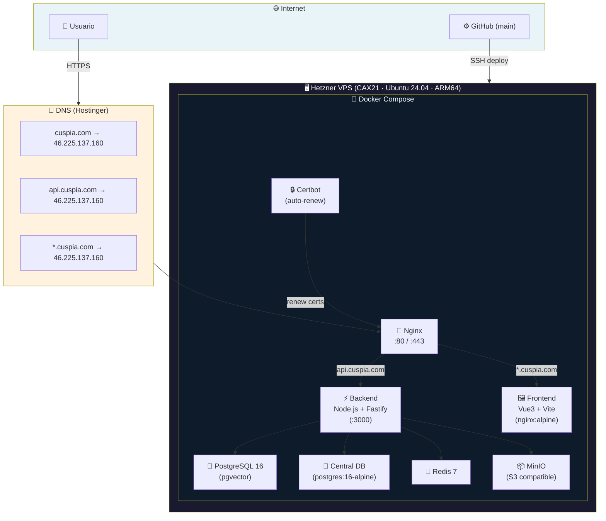

---

## 🌍 Estructura de Subdominios

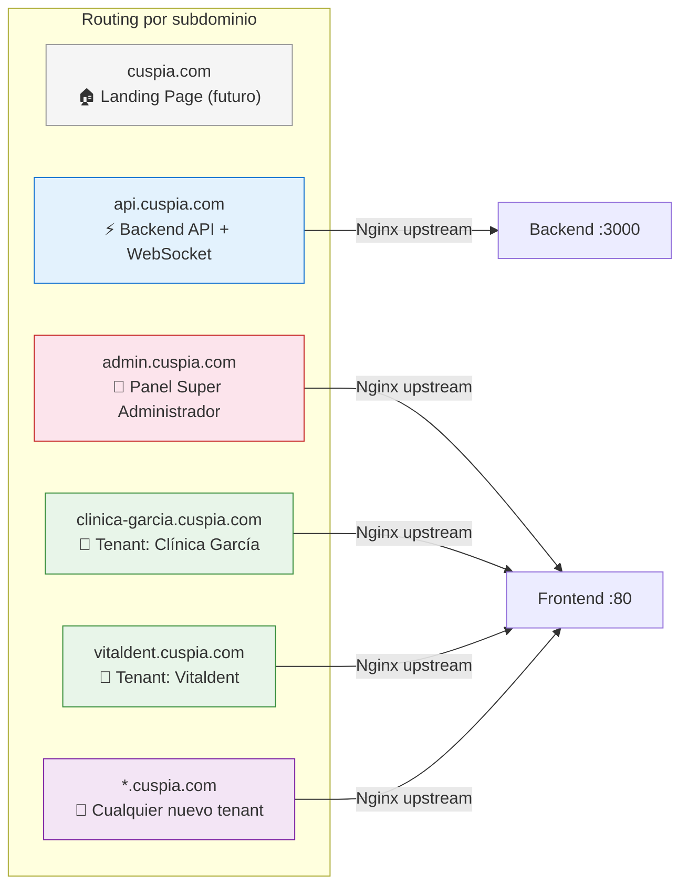

| Subdominio | Destino | Uso |
|---|---|---|
| `cuspia.com` | Libre | Landing page comercial (futuro) |
| `api.cuspia.com` | Backend (:3000) | API REST + WebSocket |
| `admin.cuspia.com` | Frontend (:80) | Panel del Super Administrador |
| `{slug}.cuspia.com` | Frontend (:80) | Acceso para cada tenant/empresa |

> **No hace falta crear DNS para nuevos tenants.** El registro wildcard (`*`) redirige automáticamente cualquier subdominio al VPS.

---

## 🐳 Arquitectura de Contenedores

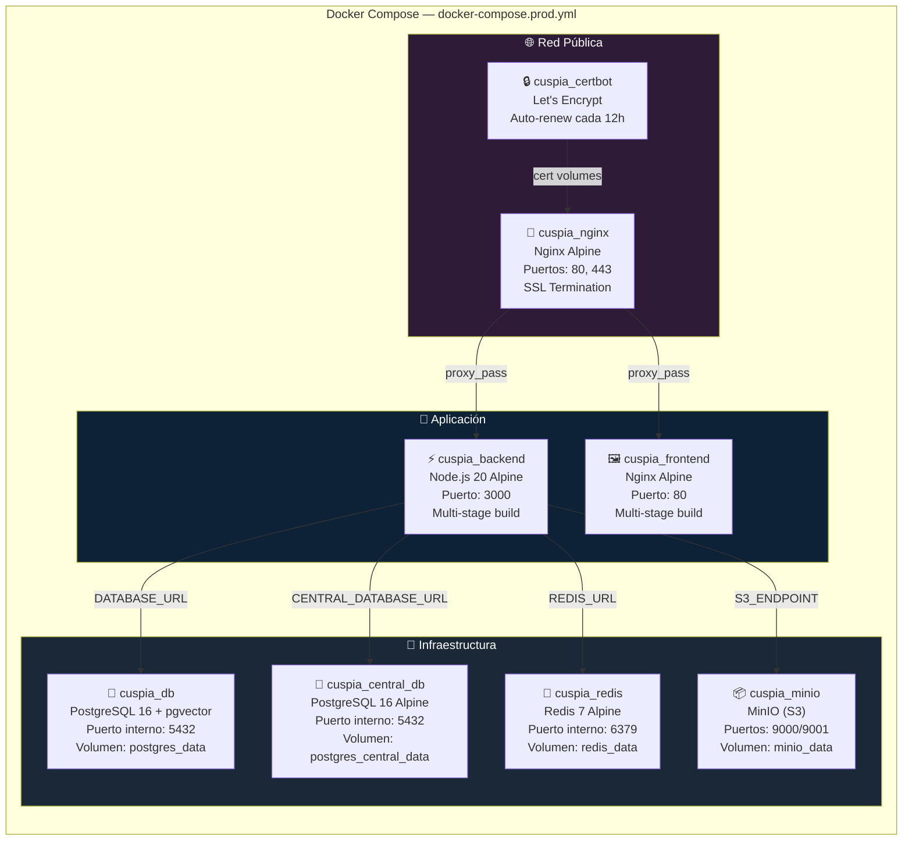

### Detalles de cada contenedor

| Contenedor | Imagen | Función | Healthcheck |
|---|---|---|---|
| `cuspia_db` | `pgvector/pgvector:pg16` | DB principal de tenants | `pg_isready` cada 10s |
| `cuspia_central_db` | `postgres:16-alpine` | DB central (tenants, superadmins, global_users) | `pg_isready` cada 10s |
| `cuspia_redis` | `redis:7-alpine` | Caché, sesiones, colas | `redis-cli ping` cada 10s |
| `cuspia_minio` | `minio/minio:latest` | Almacenamiento S3 (radiografías, media) | `curl /minio/health/live` cada 30s |
| `cuspia_backend` | Custom (Node 20 Alpine) | API REST + WebSocket + Schedulers | `wget /api/v1/health` cada 30s |
| `cuspia_frontend` | Custom (Nginx Alpine) | SPA Vue 3 | - |
| `cuspia_nginx` | `nginx:alpine` | Reverse proxy + SSL + Rate limiting | - |
| `cuspia_certbot` | `certbot/certbot` | Renovación automática SSL | Loop cada 12h |

---

## 🗄️ Arquitectura de Bases de Datos

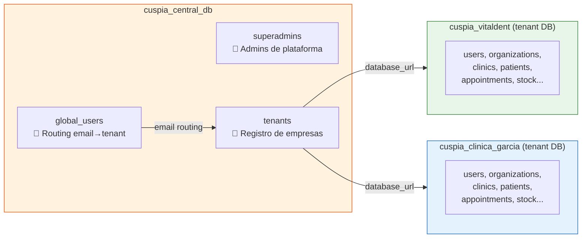

### Flujo de Login Multi-Tenant

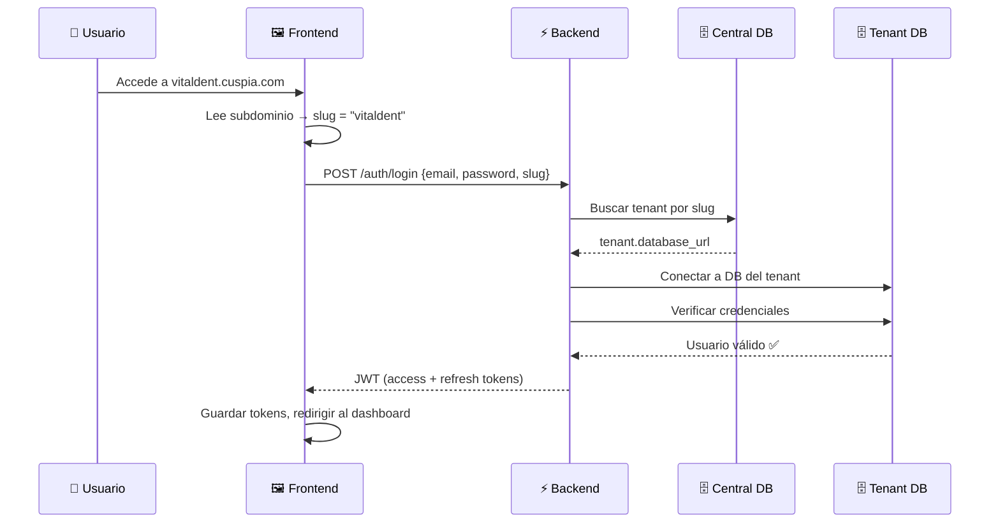

---

## 🔒 SSL / HTTPS

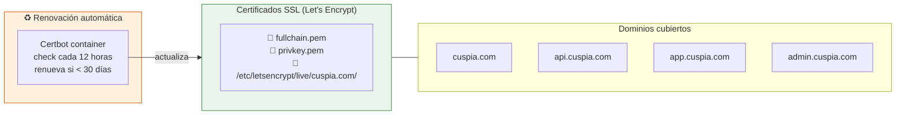

| Aspecto | Detalle |
|---|---|
| **Proveedor** | Let's Encrypt (gratuito) |
| **Duración** | 90 días |
| **Renovación** | Automática (Certbot cada 12h) |
| **Tipo** | SAN Certificate (múltiples dominios) |
| **Ubicación** | `/opt/cuspia/certbot/conf/live/cuspia.com/` |

### Añadir un nuevo subdominio al certificado

```bash
# 1. Parar Nginx temporalmente
ssh root@46.225.137.160
docker stop cuspia_nginx

# 2. Re-emitir el cert con el nuevo dominio
docker run --rm -p 80:80 \
  -v /opt/cuspia/certbot/conf:/etc/letsencrypt \
  certbot/certbot certonly --standalone \
  -d cuspia.com -d api.cuspia.com -d app.cuspia.com -d admin.cuspia.com \
  -d NUEVO_SUBDOMINIO.cuspia.com \
  --email diegolagalera12@gmail.com --agree-tos --no-eff-email --expand

# 3. Reiniciar Nginx
docker start cuspia_nginx
```

> ⚠️ **Nota**: Solo necesitas añadir subdominios al certificado si necesitan HTTPS directo. Los tenants nuevos usan el wildcard `*.cuspia.com` de Nginx, pero como el cert no es wildcard, los navegadores mostrarán un aviso SSL para subdominios no incluidos explícitamente. Si necesitas muchos tenants sin aviso, considera migrar a un certificado wildcard usando DNS-01 challenge.

---

## 🚀 Pipeline de Despliegue (CI/CD)

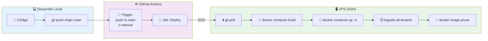

### Flujo detallado

```
1. Developer hace push a `main`
       ↓
2. GitHub Actions detecta el push
       ↓
3. Se conecta al VPS vía SSH (appleboy/ssh-action)
       ↓
4. En el VPS ejecuta:
   a) cd /opt/cuspia
   b) git pull origin main
   c) docker compose build --no-cache backend frontend
   d) docker compose up -d
   e) docker exec backend migrate-all-tenants (aplica migraciones)
   f) docker image prune -f (limpia imágenes viejas)
       ↓
5. ✅ Deploy completo
```

### GitHub Secrets necesarios

| Secret | Valor | Descripción |
|---|---|---|
| `VPS_HOST` | `46.225.137.160` | IP del servidor |
| `VPS_USER` | `root` | Usuario SSH |
| `VPS_SSH_KEY` | Contenido de `~/.ssh/id_ed25519` | Clave privada SSH |

### Deploy manual

```bash
# Si prefieres desplegar manualmente:
ssh root@46.225.137.160

cd /opt/cuspia
git pull origin main
docker compose -f docker-compose.prod.yml build --no-cache backend frontend
docker compose -f docker-compose.prod.yml --env-file .env.prod up -d

# Ver logs
docker logs cuspia_backend --tail 50 -f
```

---

## 📁 Estructura de Archivos (DevOps)

```
clinica/
├── .github/
│   └── workflows/
│       └── deploy.yml              ← CI/CD pipeline
├── backend/
│   ├── Dockerfile                  ← Multi-stage build (Node 20 Alpine)
│   ├── .dockerignore
│   ├── scripts/
│   │   └── init-db.sql             ← Script inicial PostgreSQL
│   └── docs/
│       ├── MULTI-TENANT.md         ← Guía multi-tenant
│       ├── SUBDOMAIN-TENANCY.md    ← Guía subdominios
│       └── DEVOPS.md               ← ⭐ Este documento
├── frontend/
│   ├── Dockerfile                  ← Multi-stage build (Vite → Nginx)
│   ├── .dockerignore
│   └── nginx.conf                  ← Config interna del frontend
├── nginx/
│   ├── nginx.conf                  ← ⭐ Reverse proxy principal (SSL)
│   └── nginx-init.conf            ← Config temporal HTTP (bootstrapping)
├── scripts/
│   └── setup-vps.sh                ← Script de setup inicial del VPS
├── docker-compose.prod.yml         ← ⭐ Orquestación de producción
├── .env.prod.example               ← Template de variables de entorno
└── .gitignore                      ← Excluye .env.prod, certbot/, etc.
```

---

## 🔧 Dockerfiles — Build Multi-Stage

### Backend

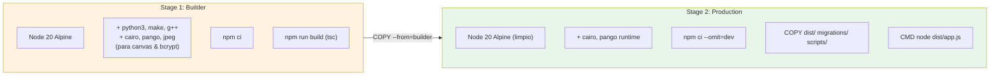

### Frontend

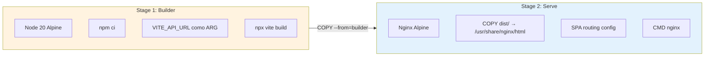

---

## 🔀 Nginx — Configuración

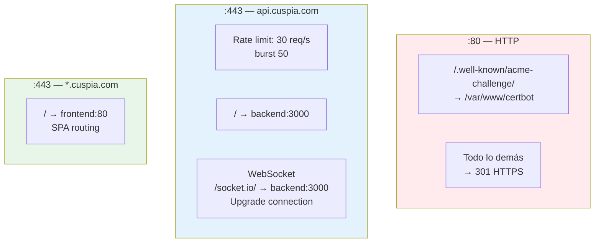

| Función | Configuración |
|---|---|
| **Rate limiting** | 30 req/s por IP (burst 50) solo en API |
| **Max body size** | 50MB (para uploads de radiografías) |
| **WebSocket** | Proxy con upgrade en `/socket.io/` |
| **SSL** | TLS 1.2 + 1.3, ciphers HIGH |
| **Timeout** | WebSocket: 86400s (24h keepalive) |

---

## 🖥️ Servidor VPS

| Aspecto | Valor |
|---|---|
| **Proveedor** | Hetzner Cloud |
| **Plan** | CAX21 (4 vCPU ARM64, 8 GB RAM, 80 GB SSD) |
| **Ubicación** | Nuremberg, Alemania |
| **OS** | Ubuntu 24.04 |
| **IP** | `46.225.137.160` |
| **Backups** | Habilitados (Hetzner automáticos) |
| **Firewall** | UFW (SSH: 22, HTTP: 80, HTTPS: 443) |
| **Proyecto** | `/opt/cuspia` |
| **Acceso** | `ssh root@46.225.137.160` |

---

## ⚙️ Variables de Entorno (Producción)

El archivo `.env.prod` vive en el VPS en `/opt/cuspia/.env.prod` y **nunca se sube a Git**.

Usa `.env.prod.example` como template:

| Variable | Ejemplo | Descripción |
|---|---|---|
| `DB_USER` | `cuspia` | Usuario PostgreSQL |
| `DB_PASSWORD` | `***` | Contraseña PostgreSQL |
| `REDIS_PASSWORD` | `***` | Contraseña Redis |
| `MINIO_USER` | `minioadmin` | Usuario MinIO |
| `MINIO_PASSWORD` | `***` | Contraseña MinIO |
| `JWT_ACCESS_SECRET` | `***` | Secret para access tokens |
| `JWT_REFRESH_SECRET` | `***` | Secret para refresh tokens |
| `FRONTEND_URL` | `https://app.cuspia.com` | URL del frontend |
| `VITE_API_URL` | `https://api.cuspia.com` | URL del API (build-time) |
| `SMTP_HOST` | `smtp.hostinger.com` | Servidor SMTP |
| `OPENAI_API_KEY` | `sk-***` | API key de OpenAI |

---

## 📋 Operaciones Comunes

### Ver estado de los contenedores
```bash
ssh root@46.225.137.160
docker ps --format 'table {{.Names}}\t{{.Status}}\t{{.Ports}}'
```

### Ver logs del backend
```bash
docker logs cuspia_backend --tail 100 -f
```

### Reiniciar un servicio
```bash
docker compose -f docker-compose.prod.yml restart backend
```

### Ejecutar migraciones
```bash
docker exec cuspia_backend node -e "
const { drizzle } = require('drizzle-orm/node-postgres');
const { migrate } = require('drizzle-orm/node-postgres/migrator');
const { Pool } = require('pg');
const pool = new Pool({ connectionString: process.env.DATABASE_URL });
const db = drizzle(pool);
migrate(db, { migrationsFolder: './migrations' })
  .then(() => { console.log('Done'); pool.end(); })
  .catch(e => { console.error(e); pool.end(); });
"
```

### Provisionar un nuevo tenant
```bash
docker exec -it cuspia_backend npx tsx src/scripts/provision-tenant.ts -- \
  --name "Nombre Empresa" \
  --slug "nombre-empresa" \
  --admin-email "admin@empresa.com" \
  --admin-password "SecurePass123!" \
  --admin-first "Nombre" \
  --admin-last "Apellido" \
  --org-name "Empresa S.L." \
  --db-host cuspia_db \
  --db-password TU_DB_PASSWORD
```

### Backup manual de la base de datos
```bash
# Backup de un tenant
docker exec cuspia_db pg_dump -U cuspia dental_erp > backup_$(date +%Y%m%d).sql

# Backup de la DB central
docker exec cuspia_central_db pg_dump -U cuspia cuspia_central > backup_central_$(date +%Y%m%d).sql
```

### Restaurar un backup
```bash
cat backup.sql | docker exec -i cuspia_db psql -U cuspia dental_erp
```

---

## 🚨 Troubleshooting

| Problema | Diagnóstico | Solución |
|---|---|---|
| Backend en restart loop | `docker logs cuspia_backend` | Revisar env vars (ej: `AI_SERVICE_URL` vacío) |
| Error SSL en nuevo subdominio | El cert no incluye ese subdominio | Re-emitir cert con `--expand` (ver sección SSL) |
| `tenants table does not exist` | Falta schema en central DB | Ejecutar `npm run central:push` dentro del container |
| Frontend muestra página en blanco | Build con API URL incorrecta | Verificar `VITE_API_URL` y rebuild frontend |
| WebSocket desconectado | Nginx no proxea `/socket.io/` | Verificar config nginx upstream |
| Puerto 80/443 no responde | Firewall o Nginx caído | `ufw status` y `docker start cuspia_nginx` |

---

## 🔄 Flujo Completo: Setup desde Cero

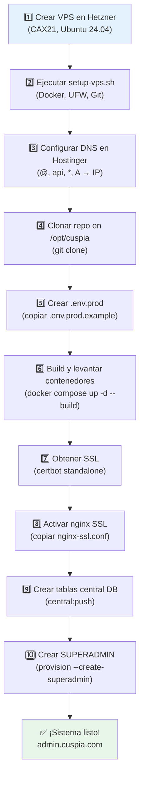

---

*Última actualización: 15 de Febrero de 2026*
