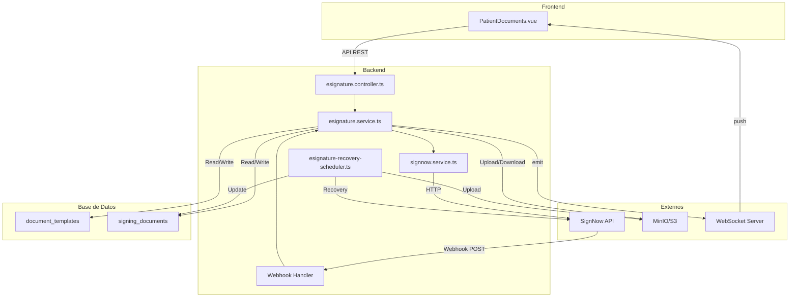
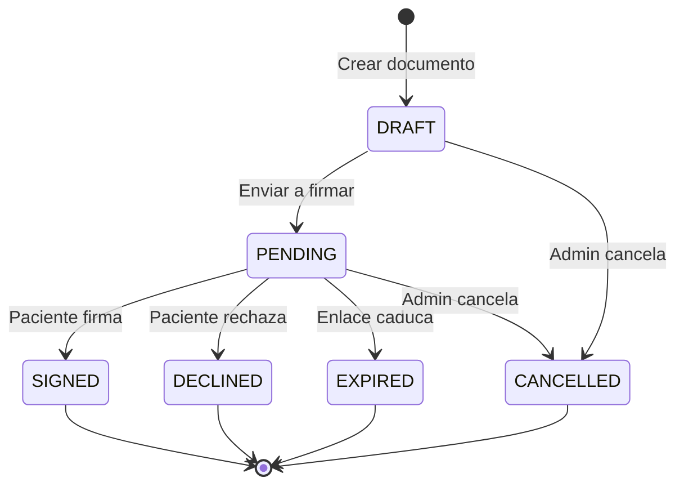
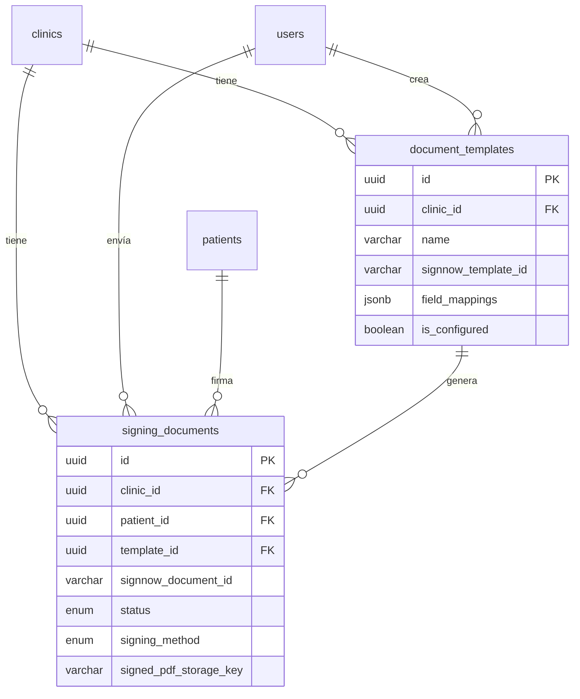
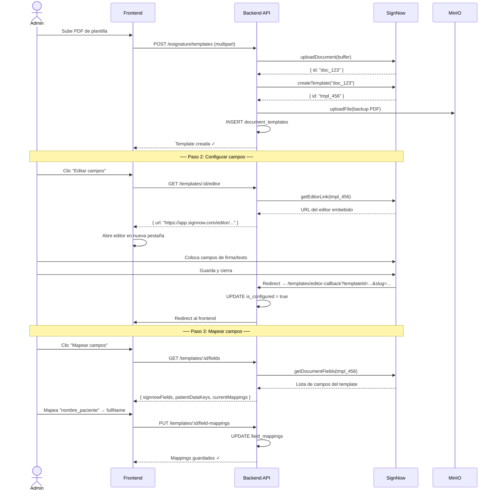
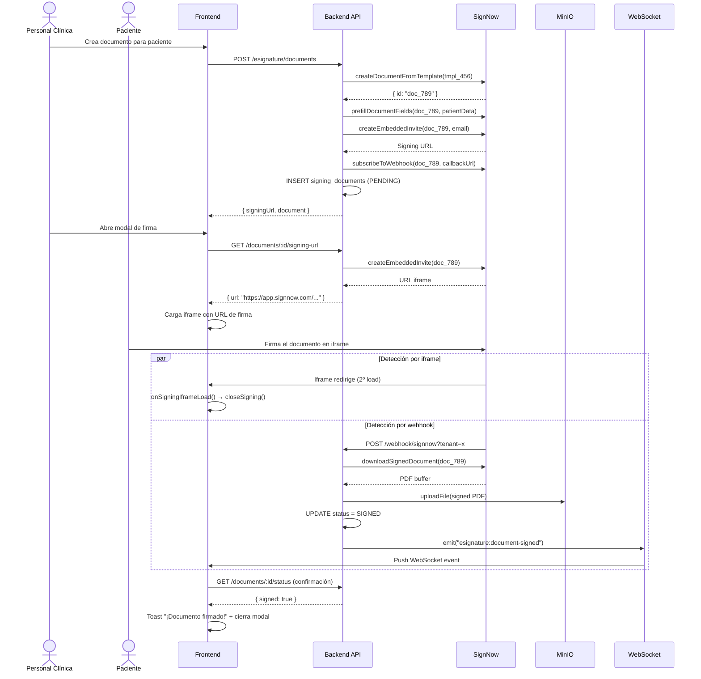
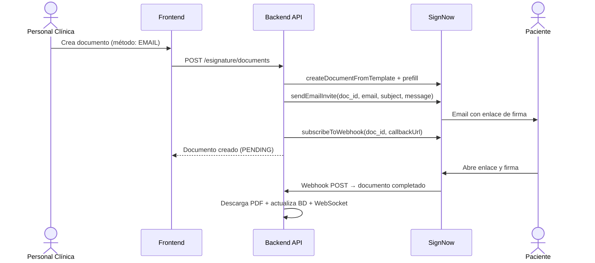
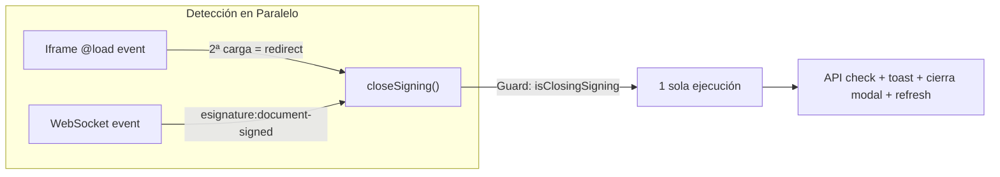
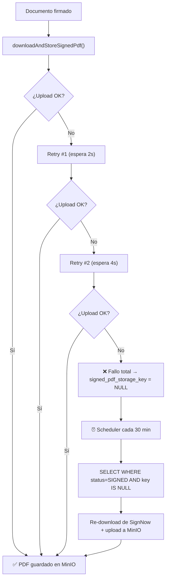
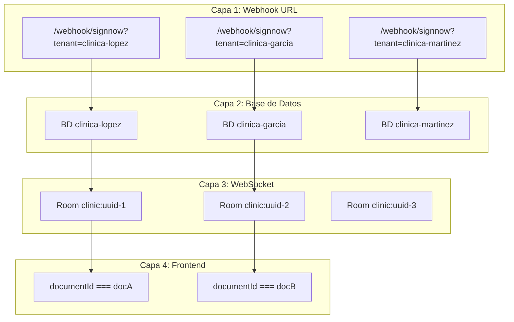

# Módulo de Firma Electrónica (E-Signature)

Documentación completa del módulo de firma digital integrado con **SignNow**. Este documento describe la arquitectura, los flujos de trabajo, los ficheros involucrados y los mecanismos de resiliencia.

---

## Índice

1. [Visión General](#visión-general)
2. [Arquitectura del Módulo](#arquitectura-del-módulo)
3. [Modelo de Datos](#modelo-de-datos)
4. [Flujos de Trabajo](#flujos-de-trabajo)
5. [API Endpoints](#api-endpoints)
6. [Servicios Backend](#servicios-backend)
7. [Frontend (PatientDocuments.vue)](#frontend)
8. [Detección de Firma (Zero Polling)](#detección-de-firma)
9. [Resiliencia y Recuperación de PDFs](#resiliencia-y-recuperación-de-pdfs)
10. [Multi-Tenancy](#multi-tenancy)
11. [Variables de Entorno](#variables-de-entorno)
12. [Troubleshooting](#troubleshooting)

---

## Visión General

El módulo permite a las clínicas:
- Subir plantillas PDF (consentimientos, autorizaciones, planes de tratamiento)
- Configurar campos de firma/texto visualmente en un editor embebido
- Mapear campos del documento a datos del paciente (auto-relleno)
- Enviar documentos a pacientes para firma (embebida en iframe o por email)
- Detectar firma en tiempo real sin polling
- Almacenar el PDF firmado en MinIO/S3

### Stack Tecnológico

| Componente | Tecnología |
|-----------|-----------|
| API de firma | SignNow v2 REST API |
| Autenticación API | API Key como Bearer Token |
| Almacenamiento | MinIO/S3 (por tenant) |
| Base de datos | PostgreSQL + Drizzle ORM |
| Tiempo real | WebSocket (Socket.IO) + Iframe load detection |
| Scheduler | node-cron (recuperación PDFs) |
| Frontend | Vue 3 (`<script setup>`) |

---

## Arquitectura del Módulo

### Diagrama de Componentes



### Estructura de Ficheros

```
backend/src/
├── controllers/
│   └── esignature.controller.ts    # 16 endpoints REST
├── services/
│   ├── esignature.service.ts       # Lógica de negocio (templates, signing, webhooks)
│   └── signnow.service.ts          # Wrapper bajo nivel de SignNow API
├── routes/
│   └── esignature.routes.ts        # Definición de rutas y middleware
├── jobs/
│   └── esignature-recovery-scheduler.ts  # Recuperación automática de PDFs
└── db/
    └── schema.ts                   # Tablas: document_templates, signing_documents

frontend/src/pages/clinic/
└── PatientDocuments.vue            # Vista de documentos del paciente (firma embebida)
```

---

## Modelo de Datos

### Enums

```sql
-- Categorías de plantillas
document_template_category: CONSENT | DATA_PROTECTION | SURGERY_AUTH | TREATMENT_PLAN
                          | ORTHODONTICS | EXTRACTION | WHITENING | MINOR_AUTH
                          | RADIOGRAPH_CONSENT | OTHER

-- Estados del documento de firma
signing_status: DRAFT | PENDING | SIGNED | DECLINED | EXPIRED | CANCELLED

-- Método de firma
signing_method: EMBEDDED | EMAIL
```

### Máquina de Estados del Documento



> [!IMPORTANT]
> Los documentos en estado `SIGNED` **no se pueden cancelar**. La cancelación solo aplica a `DRAFT` y `PENDING`.

### Tabla: `document_templates`

Plantillas reutilizables configuradas por el administrador de la clínica.

| Campo | Tipo | Descripción |
|-------|------|-------------|
| `id` | UUID (PK) | Identificador único |
| `clinic_id` | UUID (FK → clinics) | Clínica propietaria |
| `name` | VARCHAR(255) | Nombre de la plantilla |
| `description` | TEXT | Descripción opcional |
| `category` | ENUM | Categoría del documento |
| `signnow_template_id` | VARCHAR(255) | ID de la plantilla en SignNow |
| `file_storage_key` | VARCHAR(500) | Backup del PDF original en MinIO |
| `fields` | JSONB | Posiciones de campos `[{name, type, x, y, width, height, page}]` |
| `field_mappings` | JSONB | Mapeo a datos del paciente `[{signnowFieldName, patientDataKey, label}]` |
| `is_active` | BOOLEAN | Soft delete (desactivación) |
| `is_configured` | BOOLEAN | Si los campos han sido configurados en el editor |
| `created_by_id` | UUID (FK → users) | Usuario que creó la plantilla |

### Tabla: `signing_documents`

Instancias individuales de documentos enviados a pacientes para firma.

| Campo | Tipo | Descripción |
|-------|------|-------------|
| `id` | UUID (PK) | Identificador único |
| `clinic_id` | UUID (FK → clinics) | Clínica |
| `patient_id` | UUID (FK → patients) | Paciente que firma |
| `template_id` | UUID (FK → document_templates) | Plantilla de origen |
| `name` | VARCHAR(255) | Nombre del documento |
| `signnow_document_id` | VARCHAR(255) | ID del documento clonado en SignNow |
| `status` | ENUM | Estado actual (`DRAFT` → `PENDING` → `SIGNED`) |
| `signing_method` | ENUM | Método: `EMBEDDED` (iframe) o `EMAIL` |
| `signed_at` | TIMESTAMP | Fecha/hora de firma |
| `signed_pdf_storage_key` | VARCHAR(500) | Key del PDF firmado en MinIO |
| `sent_by_id` | UUID (FK → users) | Usuario que envió el documento |
| `email_sent_to` | VARCHAR(255) | Email del firmante (si método EMAIL) |
| `expires_at` | TIMESTAMP | Expiración del enlace de firma |
| `metadata` | JSONB | Datos extra de la respuesta de SignNow |

### Diagrama Entidad-Relación



---

## Flujos de Trabajo

### 1. Configuración de Plantilla (Admin)



### 2. Firma Embebida (In-Clinic / Tablet)



### 3. Firma por Email



---

## API Endpoints

### Rutas Públicas (sin autenticación)

| Método | Ruta | Descripción |
|--------|------|-------------|
| `POST` | `/esignature/webhook/signnow` | Callback de webhooks de SignNow |
| `GET` | `/esignature/templates/editor-callback` | Redirect desde editor embebido SignNow |

### Rutas Protegidas (requieren auth + staff + tenant)

#### Configuración

| Método | Ruta | Descripción |
|--------|------|-------------|
| `GET` | `/esignature/config/status` | Verificar si SignNow está configurado |
| `GET` | `/esignature/patient-data-keys` | Claves disponibles para mapeo de campos |

#### Gestión de Plantillas

| Método | Ruta | Descripción |
|--------|------|-------------|
| `GET` | `/esignature/templates` | Listar plantillas de la clínica |
| `POST` | `/esignature/templates` | Crear plantilla (subida de PDF, multipart) |
| `GET` | `/esignature/templates/:id/preview` | Descargar PDF de vista previa |
| `GET` | `/esignature/templates/:id/editor` | Obtener URL del editor de campos |
| `GET` | `/esignature/templates/:id/fields` | Obtener campos para mapeo |
| `PUT` | `/esignature/templates/:id/field-mappings` | Guardar mapeo de campos |
| `DELETE` | `/esignature/templates/:id` | Desactivar plantilla (soft delete) |

#### Documentos de Firma

| Método | Ruta | Descripción |
|--------|------|-------------|
| `GET` | `/esignature/documents/patient/:patientId` | Documentos de un paciente |
| `POST` | `/esignature/documents` | Crear documento y enviar a firmar |
| `GET` | `/esignature/documents/:id/signing-url` | URL para firma embebida (iframe) |
| `GET` | `/esignature/documents/:id/status` | Comprobar estado de firma |
| `GET` | `/esignature/documents/:id/download` | Descargar PDF firmado |
| `DELETE` | `/esignature/documents/:id` | Cancelar documento (DRAFT/PENDING) |

---

## Servicios Backend

### `signnow.service.ts` — Wrapper de SignNow API

Capa de bajo nivel que encapsula todas las llamadas HTTP a la API de SignNow.

| Función | Descripción |
|---------|-------------|
| `checkConfiguration()` | Verifica que las credenciales de SignNow están configuradas |
| `getAccessToken()` | Devuelve el API Key como Bearer token |
| `uploadDocument(buffer, filename)` | Sube un PDF a SignNow |
| `createTemplate(documentId)` | Convierte un documento en plantilla reutilizable |
| `createDocumentFromTemplate(templateId, name)` | Clona un template para firma individual |
| `getDocumentRoles(documentId)` | Obtiene los roles (firmantes) del documento |
| `getDocumentFields(documentId)` | Lista campos (firma, texto, etc.) del documento |
| `addTextFields(documentId, fields)` | Añade campos de texto al documento |
| `addSignatureFields(documentId, fields)` | Añade campos de firma |
| `prefillDocumentFields(documentId, fields)` | Pre-rellena campos de texto con datos |
| `createEmbeddedInvite(documentId, email)` | Genera URL para firma en iframe |
| `sendEmailInvite(documentId, email, ...)` | Envía invitación de firma por email |
| `subscribeToWebhook(documentId, callbackUrl)` | Suscribe webhook para recibir notificaciones |
| `getDocumentStatus(documentId)` | Consulta estado de firma |
| `downloadSignedDocument(documentId)` | Descarga el PDF firmado como Buffer |
| `getEditorLink(documentId, redirectUri)` | URL para editor de campos visual |
| `cancelInvites(documentId)` | Cancela invitaciones activas de firma |
| `deleteDocument(documentId)` | Elimina documento de SignNow |

### `esignature.service.ts` — Lógica de Negocio

Orquesta entre la BD, SignNow API y almacenamiento.

| Función | Descripción |
|---------|-------------|
| **Templates** | |
| `getTemplates(db, tenantContext)` | Lista plantillas activas de la clínica |
| `getTemplateById(db, id, tenantContext)` | Obtiene una plantilla por ID |
| `createTemplate(db, data, tenantContext)` | Crea plantilla: sube a SignNow + backup S3 + BD |
| `getTemplatePreviewPdf(db, id, tenantContext)` | Descarga PDF de vista previa |
| `deactivateTemplate(db, id, tenantContext)` | Soft delete de plantilla |
| `getTemplateEditorUrl(db, id, tenantContext)` | URL para configurar campos visualmente |
| `handleEditorCallback(db, templateId)` | Marca plantilla como configurada |
| `getTemplateFields(db, id, tenantContext)` | Campos del template + claves de paciente disponibles |
| `saveFieldMappings(db, id, mappings, ctx)` | Guarda mapeo campo↔dato_paciente |
| **Documentos** | |
| `getPatientDocuments(db, patientId, ctx)` | Lista documentos de firma del paciente |
| `createSigningDocument(db, data, ctx)` | Crea doc: clona template → prefill → invite → webhook |
| `getEmbeddedSigningUrl(db, docId, ctx)` | Genera URL de firma embebida |
| `checkAndUpdateStatus(db, docId, ctx)` | Check puntual del estado (con retry de PDF) |
| `downloadSignedPdf(db, docId, ctx)` | Descarga PDF firmado desde MinIO |
| `cancelSigningDocument(db, docId, ctx)` | Cancela doc (DRAFT/PENDING): revoca invites + elimina de SignNow + CANCELLED |
| `handleWebhook(db, payload, tenantSlug)` | Procesa webhook: descarga PDF → actualiza BD → WebSocket |

### Datos del Paciente Auto-Rellenables

Los campos de texto mapeados se rellenan automáticamente con datos del paciente:

| Clave | Etiqueta | Ejemplo |
|-------|----------|---------|
| `fullName` | Nombre completo | "María García López" |
| `firstName` | Nombre | "María" |
| `lastName` | Apellidos | "García López" |
| `idNumber` | DNI/NIE | "12345678A" |
| `email` | Email | "maria@email.com" |
| `phone` | Teléfono | "+34612345678" |
| `dateOfBirth` | Fecha de nacimiento | "15/03/1990" |
| `currentDate` | Fecha actual | "18/02/2026" |
| `address` | Dirección | "Calle Mayor 1, Madrid" |

---

## Frontend

### `PatientDocuments.vue`

Componente Vue 3 que gestiona la vista de documentos del paciente. Incluye:
- Lista de documentos con estado (DRAFT, PENDING, SIGNED)
- Modal con iframe para firma embebida
- Detección automática de firma completada
- Botón manual "Comprobar estado"
- Descarga de PDF firmado

### Variables de Estado Clave

| Variable | Tipo | Propósito |
|----------|------|-----------|
| `showSigningModal` | `ref<boolean>` | Controla visibilidad del modal de firma |
| `signingUrl` | `ref<string>` | URL cargada en el iframe |
| `signingDocId` | `ref<string>` | ID del documento en firma activa |
| `iframeLoadCount` | `ref<number>` | Contador de cargas del iframe (2ª = firma completada) |
| `isClosingSigning` | `let boolean` | Guard contra ejecuciones simultáneas de `closeSigning()` |

---

## Detección de Firma

> [!IMPORTANT]
> **Este módulo usa CERO POLLING.** No hay `setInterval`, no hay llamadas repetidas a la API de SignNow.

### Mecanismo Dual

La detección de firma usa dos mecanismos complementarios que compiten para dar la detección más rápida:



#### Camino 1: Detección por Iframe (`onSigningIframeLoad`)

```
1. Iframe carga URL de firma → iframeLoadCount = 1 (primera carga)
2. Paciente firma el documento
3. SignNow redirige el iframe a otra página → iframeLoadCount = 2
4. Segunda carga detectada → closeSigning() se ejecuta
```

**Latencia**: ~0ms (instantáneo al completar firma)

#### Camino 2: Detección por WebSocket

```
1. SignNow envía webhook POST al backend
2. Backend descarga PDF, actualiza BD, emite WebSocket
3. Frontend recibe "esignature:document-signed"
4. Verifica documentId, llama closeSigning()
```

**Latencia**: 2-10 segundos (depende de SignNow + red)

#### Protección contra Race Condition

Ambos caminos pueden dispararse simultáneamente. El guard `isClosingSigning` garantiza:
- Solo UNA ejecución de `closeSigning()`
- Solo UN toast de éxito
- Solo UN API check de confirmación

```javascript
const closeSigning = async () => {
  if (isClosingSigning) return  // ← Guard: previene doble ejecución
  isClosingSigning = true
  // ... lógica de cierre ...
  isClosingSigning = false
}
```

---

## Resiliencia y Recuperación de PDFs

### Problema

Si MinIO está caído cuando se firma un documento, el PDF no se puede almacenar. El documento queda con:
- `status = 'SIGNED'` ✓ (correcto)
- `signed_pdf_storage_key = NULL` ✗ (PDF perdido)

### Solución: Doble Capa de Protección



### Capa 1: Retry con Backoff Exponencial

Función `downloadAndStoreSignedPdf()` en `esignature.service.ts`:

| Intento | Espera | Total acumulado |
|---------|--------|-----------------|
| 1 | 0s | 0s |
| 2 | 2s | 2s |
| 3 | 4s | 6s |

Usada automáticamente por:
- `handleWebhook()` — cuando llega el webhook de SignNow
- `checkAndUpdateStatus()` — cuando el usuario comprueba manualmente

### Capa 2: Scheduler de Recuperación Automática

Fichero: `esignature-recovery-scheduler.ts`

| Parámetro | Valor | Descripción |
|-----------|-------|-------------|
| **Frecuencia** | Cada 30 minutos | Cron: `*/30 * * * *` |
| **Máx. docs/tenant** | 20 | Previene sobrecarga |
| **Delay entre docs** | 3 segundos | Evita rate limiting de SignNow |
| **Query** | `status=SIGNED AND signed_pdf_storage_key IS NULL` | Solo docs huérfanos |

**Flujo por ejecución:**
1. Obtiene todos los tenants activos de la BD central
2. Por cada tenant, busca documentos huérfanos (max. 20)
3. Por cada documento:
   - Descarga PDF de SignNow API
   - Sube a MinIO
   - Actualiza `signed_pdf_storage_key` en BD
   - Espera 3s antes del siguiente
4. Log resumen: `recovered: X, failed: Y, total: Z`

> [!NOTE]
> SignNow retiene los documentos firmados durante 30+ días, dando un amplio margen de recuperación.

---

## Multi-Tenancy

### Aislamiento por Capas



| Capa | Mecanismo de Aislamiento | ¿Conflicto posible? |
|------|--------------------------|---------------------|
| **Webhook URL** | `?tenant=slug` en la URL de callback | ❌ No — cada doc tiene su slug |
| **Base de datos** | Cada tenant tiene su propia BD | ❌ No — BDs separadas |
| **Búsqueda** | `WHERE signnow_document_id = ?` | ❌ No — IDs únicos por doc |
| **WebSocket** | `emitToClinic(clinicId, ...)` | ❌ No — rooms por clínica |
| **Frontend** | `event.documentId === docId` | ❌ No — filtra por doc exacto |
| **Token SignNow** | Compartido entre tenants | ⚠️ Compartido, pero sin polling = bajo riesgo |

### Webhook con Tenant Fallback

Si el webhook llega sin `?tenant=slug` (suscripciones antiguas):

```
1. Obtener todos los tenants activos
2. Para cada tenant:
   a. Buscar signing_document por signnow_document_id
   b. Si encontrado → procesar y break
   c. Si no → continuar con siguiente tenant
```

---

## Variables de Entorno

```env
# SignNow API Configuration
SIGNNOW_API_KEY=tu_api_key_aquí
SIGNNOW_BASE_URL=https://api.signnow.com     # Producción
# SIGNNOW_BASE_URL=https://api-eval.signnow.com  # Sandbox/Testing
```

> [!CAUTION]
> La `SIGNNOW_API_KEY` es un secreto. No commitear en el repositorio. Configurar en variables de entorno del servidor.

---

## Troubleshooting

### El webhook no llega

1. **Verificar URL de callback**: El backend debe ser accesible públicamente. Comprobar que el dominio/IP del servidor es correcto.
2. **Verificar endpoint**: `POST /api/v1/esignature/webhook/signnow` debe estar antes del middleware de autenticación.
3. **Comprobar logs**: Buscar `[ESignature Webhook] Received:` en los logs del servidor.
4. **Verificar suscripción**: La función `subscribeToWebhook()` se ejecuta al crear cada documento de firma.

### El modal no se cierra automáticamente

1. **Detección por iframe**: Verificar que el iframe tiene `@load="onSigningIframeLoad"`. La 2ª carga debe disparar `closeSigning()`.
2. **WebSocket**: Verificar que el WebSocket está conectado. Comprobar que `startWebSocketListener()` se ejecuta al abrir el modal.
3. **Guard activo**: Si `isClosingSigning` quedó en `true` (por un error previo), el modal no se cerrará. Esto se resetea al cerrar manualmente y al abrir un nuevo modal.

### El PDF firmado no se descarga

1. **Verificar MinIO**: Comprobar que MinIO está corriendo y accesible.
2. **Verificar `signed_pdf_storage_key`**: Si es `NULL`, el PDF no se subió a MinIO.
3. **Esperar al scheduler**: El scheduler de recuperación reintentará la descarga cada 30 minutos.
4. **Comprobar logs**: Buscar `[ESignature] Failed to download/store signed PDF` o `📄 PDF recovery`.

### Documentos con estado SIGNED pero sin PDF

Esto indica que MinIO estaba caído cuando se firmó el documento. El sistema tiene dos mecanismos de recuperación:
1. **Retry automático** (3 intentos con backoff de 2s/4s/8s)
2. **Scheduler** (cada 30 min, `esignature-recovery-scheduler.ts`)

Para verificar manualmente:
```sql
-- Buscar documentos huérfanos
SELECT id, name, status, signed_pdf_storage_key, signed_at
FROM signing_documents
WHERE status = 'SIGNED' AND signed_pdf_storage_key IS NULL;
```

### Error "Solo se permiten archivos PDF o Word"

El upload de plantillas acepta: `application/pdf`, `application/msword`, `application/vnd.openxmlformats-officedocument.wordprocessingml.document`. Máximo 20MB.

---

*Última actualización: 18 de febrero de 2026*
