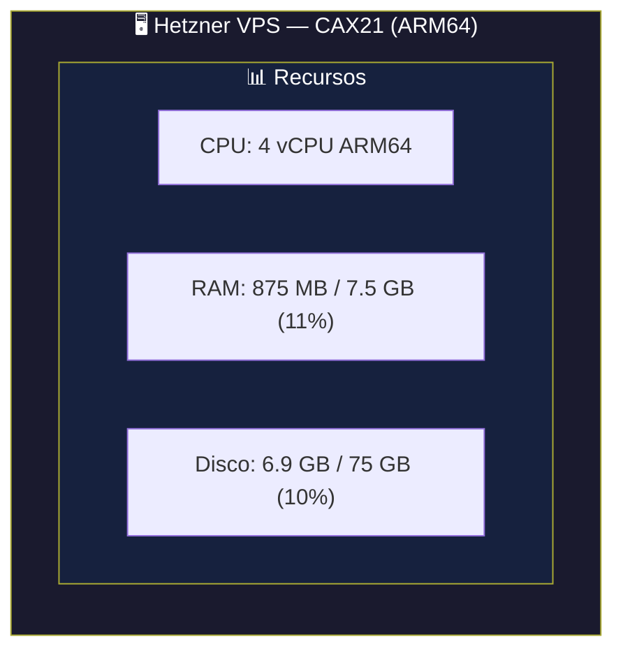
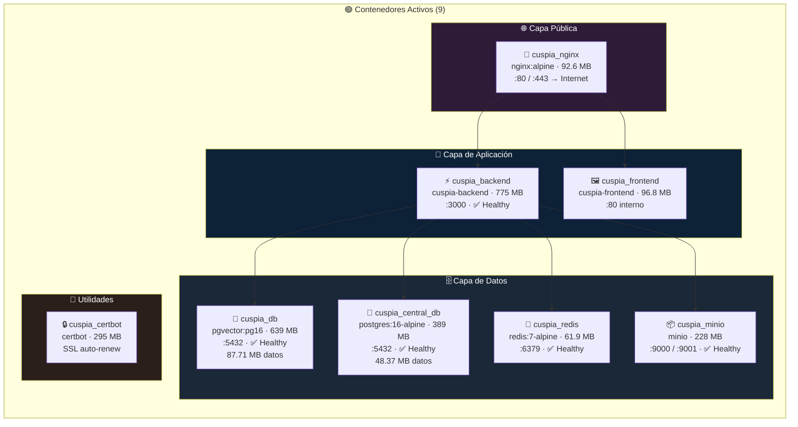
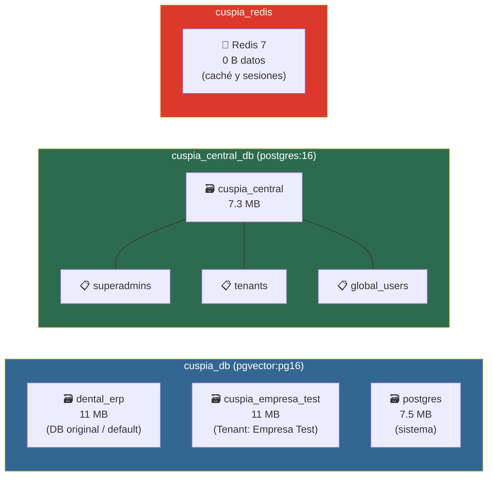
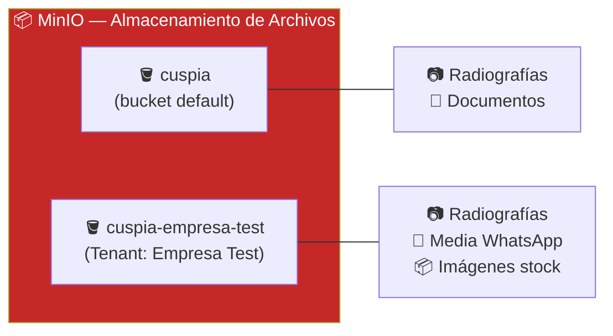
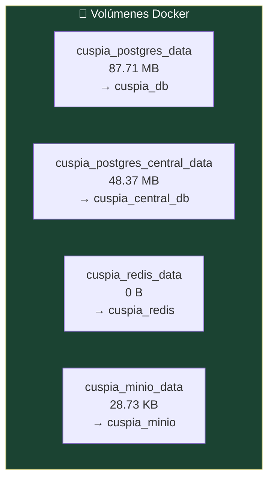
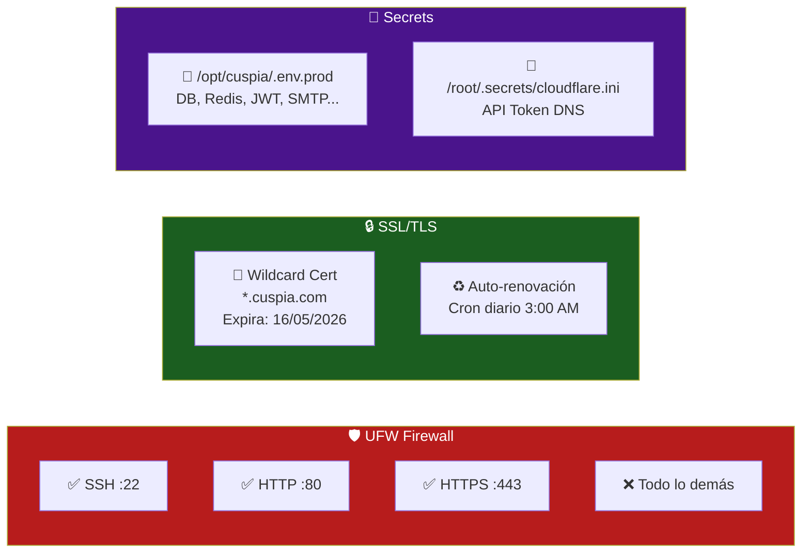
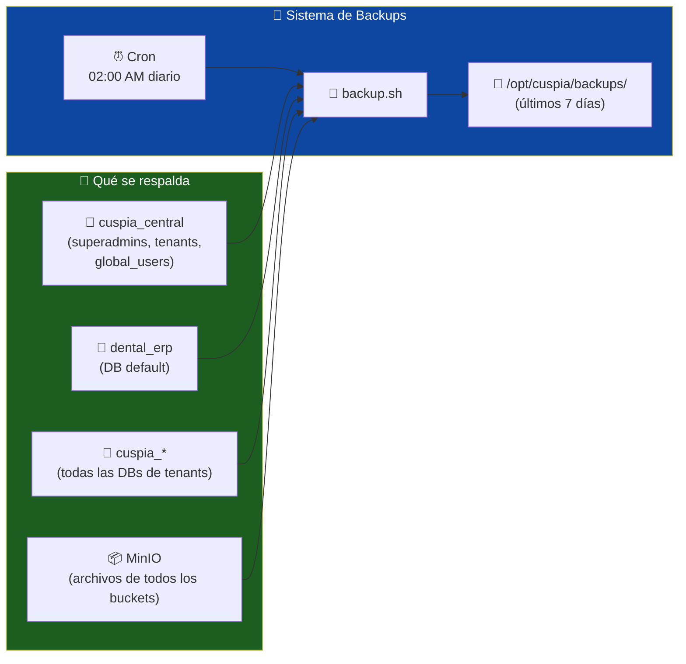
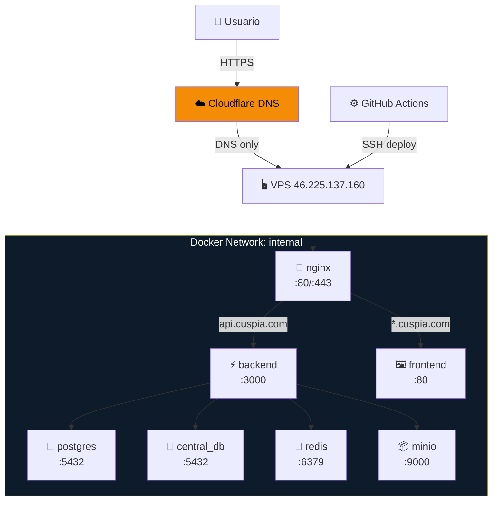

# 📊 CUSPIA — Estado del Servidor en Producción

> Última inspección: **15 de Febrero de 2026, 23:10 UTC**
> Servidor: `46.225.137.160` (Hetzner CAX21)

---

## 🖥️ Vista General

---

## 🐳 Contenedores Docker

---

## 🗄️ Bases de Datos

### Tenants Registrados

| Empresa | Slug | Plan | Estado | DB | Creado |
|---|---|---|---|---|---|
| Empresa Test | `empresa-test` | basic | ✅ Activo | `cuspia_empresa_test` | 15/02/2026 |

---

## 📦 MinIO (Almacenamiento S3)

---

## 💾 Volúmenes Docker (Persistencia)

| Volumen | Tamaño | Contenedor |
|---|---|---|
| `cuspia_postgres_data` | 87.71 MB | cuspia_db |
| `cuspia_postgres_central_data` | 48.37 MB | cuspia_central_db |
| `cuspia_redis_data` | 0 B | cuspia_redis |
| `cuspia_minio_data` | 28.73 KB | cuspia_minio |

---

## ⚡ Imágenes Docker

| Imagen | Tamaño | Tipo |
|---|---|---|
| `cuspia-backend` | 775 MB | Custom (Node 20 multi-stage) |
| `pgvector/pgvector:pg16` | 639 MB | Oficial |
| `postgres:16-alpine` | 389 MB | Oficial |
| `certbot/certbot` | 295 MB | Oficial |
| `minio/minio` | 228 MB | Oficial |
| `minio/mc` | 112 MB | Oficial |
| `cuspia-frontend` | 96.8 MB | Custom (Vite + Nginx) |
| `nginx:alpine` | 92.6 MB | Oficial |
| `redis:7-alpine` | 61.9 MB | Oficial |

---

## 🔒 Seguridad

---

## 🔄 Tareas Programadas (Cron)

| Hora | Tarea | Log |
|---|---|---|
| 03:00 AM diario | Renovación SSL (Certbot + Cloudflare) | `/var/log/certbot-renew.log` |
| 02:00 AM diario | 🆕 Backup DBs (ver sección siguiente) | `/var/log/cuspia-backup.log` |

---

## 💾 Copias de Seguridad

### Política de retención
- **Local**: últimos 7 días en `/opt/cuspia/backups/`
- **Nombres**: `central_2026-02-15.sql.gz`, `tenant_empresa-test_2026-02-15.sql.gz`, etc.
- **Frecuencia**: diaria a las 02:00 AM

---

## 🗺️ Mapa Completo de Red

---

*Para actualizar este documento, ejecuta el script de inspección del servidor y actualiza los datos.*
