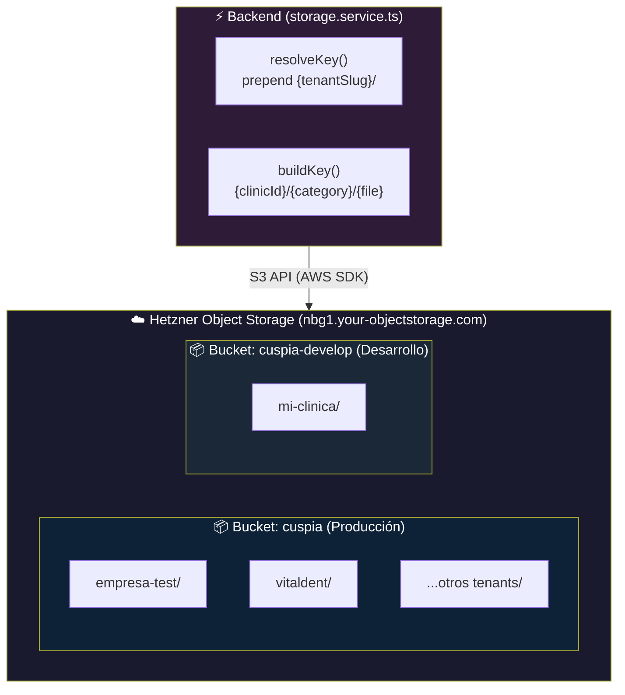
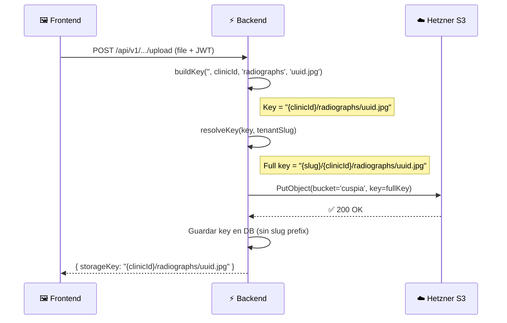
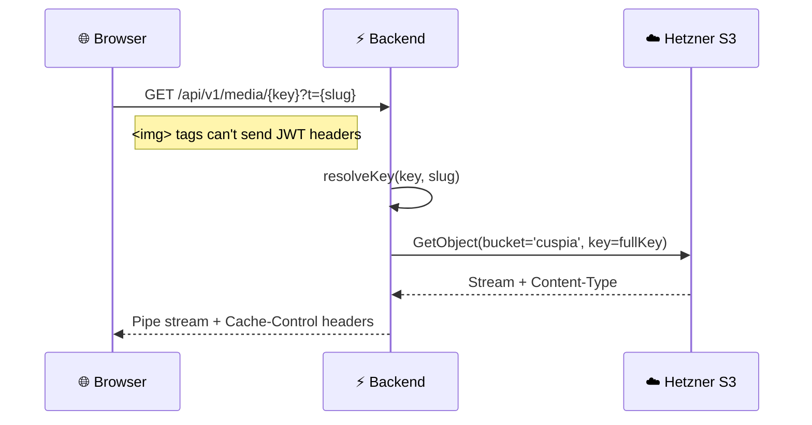

# 📦 Arquitectura de Storage — Cuspia

> Guía completa del sistema de almacenamiento de archivos S3 (Hetzner Object Storage).

---

## 📐 Arquitectura General



---

## 🏗️ Estrategia: Bucket Único con Prefijos

Todos los tenants comparten un **único bucket S3**, con aislamiento por **prefijo de key**:

```
{tenantSlug}/{clinicId}/{category}/{filename}
```

| Componente | Origen | Ejemplo |
|---|---|---|
| `tenantSlug` | JWT del usuario o query param `?t=` | `empresa-test` |
| `clinicId` | UUID de la clínica activa | `d3443dee-da44-4df3-...` |
| `category` | Tipo de archivo (`StorageCategory`) | `radiographs` |
| `filename` | UUID generado + extensión | `43b9f4bb.jpg` |

### Ventajas del Bucket Único

| ✅ Ventaja | ❌ Alternativa descartada |
|---|---|
| Sin límite de tenants (Hetzner limita a 100 buckets) | Bucket por tenant |
| Backup selectivo por tenant con `rclone copy bucket/{slug}/` | Backup de buckets individuales |
| Un solo set de credenciales S3 | Permisos por bucket |
| Fácil migración entre proveedores | Vendor lock-in por estructura |

---

## 📁 Estructura Completa del Bucket

```
📦 cuspia (producción) / cuspia-develop (desarrollo)
│
├── empresa-test/                              ← Tenant
│   ├── d3443dee-.../                          ← Clínica A
│   │   ├── radiographs/                       🦷 Radiografías
│   │   │   └── 43b9f4bb-...-uuid.jpg
│   │   ├── esignature/                        ✍️ Firma electrónica
│   │   │   ├── signed/uuid_signed.pdf           └─ PDFs firmados
│   │   │   └── templates/1771362376647_doc.pdf  └─ Plantillas subidas
│   │   ├── stock-images/                      📦 Fotos de productos
│   │   │   └── af0516ea-...-uuid.png
│   │   ├── whatsapp-media/                    💬 Media de WhatsApp
│   │   │   └── {conversationId}/uuid.jpg
│   │   ├── chatbot-knowledge/                 🤖 Base de conocimiento IA
│   │   │   └── document.pdf
│   │   └── prescriptions/                     💊 Recetas médicas (PDF)
│   │       └── 935b61aa-...-uuid.pdf
│   │
│   └── a1b2c3d4-.../                          ← Clínica B (mismo tenant)
│       └── ... (misma estructura)
│
├── vitaldent/                                 ← Otro tenant
│   └── {clinicId}/...
│
└── clinica-garcia/                            ← Otro tenant
    └── {clinicId}/...
```

---

## 🔧 Implementación Técnica

### Archivos clave

| Archivo | Responsabilidad |
|---|---|
| [`storage.service.ts`](file:///Users/diegomartinez/clinica/backend/src/services/storage.service.ts) | Core S3 operations + key resolution |
| [`env.ts`](file:///Users/diegomartinez/clinica/backend/src/config/env.ts) | Configuración S3 (endpoint, credentials, bucket) |

### Categorías de almacenamiento (`StorageCategory`)

```typescript
type StorageCategory =
    | 'radiographs'        // 🦷 Radiografías (JPG/PNG)
    | 'stock-images'       // 📦 Fotos de productos (PNG)
    | 'whatsapp-media'     // 💬 Media de WhatsApp (JPG/audio/docs)
    | 'chatbot-knowledge'  // 🤖 Documentos para el asistente IA
    | 'esignature'         // ✍️ Plantillas y PDFs firmados
    | 'prescriptions';     // 💊 Recetas médicas generadas (PDF)
```

### Flujo de un upload



> **Nota importante**: En la DB se guarda el key **sin** el prefijo del tenant (`{clinicId}/category/file`). El prefijo se añade dinámicamente en cada operación S3 via `resolveKey()`.

### Flujo de un download (media serving)



---

## 🔐 Seguridad

| Aspecto | Implementación |
|---|---|
| **Bucket privado** | No hay acceso público, todo pasa por el backend |
| **Aislamiento de tenants** | Prefijo `{slug}/` en cada key, resuelto desde JWT |
| **Keys no adivinables** | Contienen UUIDs v4 (`af0516ea-0020-4781-...`) |
| **Media serving** | Endpoint `/api/v1/media/*` sin auth (para `` tags) pero con UUIDs |
| **Credenciales** | Nunca en el repo, solo en `.env` / `.env.prod` del servidor |

---

## ⚙️ Configuración

### Variables de entorno

| Variable | Desarrollo | Producción |
|---|---|---|
| `S3_ENDPOINT` | `https://nbg1.your-objectstorage.com` | `https://nbg1.your-objectstorage.com` |
| `S3_ACCESS_KEY` | `***` | `***` |
| `S3_SECRET_KEY` | `***` | `***` |
| `S3_BUCKET` | `cuspia-develop` | `cuspia` |
| `S3_REGION` | `nbg1` | `nbg1` |

### Resumen de entornos

| Entorno | Bucket | Tenants | Endpoint |
|---|---|---|---|
| **Producción** | `cuspia` | `empresa-test`, ... | `nbg1.your-objectstorage.com` |
| **Desarrollo** | `cuspia-develop` | `mi-clinica` | `nbg1.your-objectstorage.com` |

---

## 🔄 Ciclo de vida

### Al provisionar un tenant (`tenant:provision`)

```
ensureBucketExists(slug) → Verifica que el bucket compartido existe (idempotente)
```

No se crea nada específico para el tenant. Los prefijos se crean automáticamente al subir el primer archivo.

### Al eliminar un tenant (`cleanup-tenant.ts`)

```
deleteBucketWithContents(slug) → Lista y borra TODOS los objetos con prefijo "{slug}/"
```

Elimina recursivamente todos los archivos del tenant (radiografías, stock, recetas, media, etc.) sin tocar datos de otros tenants.

### Backup de un tenant

```bash
rclone copy hetzner:cuspia/{slug}/ /backup/{slug}/ --progress
```

---

## 📋 Funciones disponibles

| Función | Descripción |
|---|---|
| `buildKey(orgId, clinicId, category, ...parts)` | Construye key: `{clinicId}/{category}/{parts}` |
| `resolveKey(key, tenantSlug)` | Añade prefijo: `{slug}/{key}` |
| `ensureBucketExists(slug)` | Verifica bucket compartido (idempotente) |
| `deleteBucketWithContents(slug)` | Borra todos los objetos del tenant |
| `uploadFile(key, buffer, mimeType, slug)` | Sube archivo a S3 |
| `getFileStream(key, slug)` | Obtiene archivo como stream (para HTTP) |
| `getFileBuffer(key, slug)` | Obtiene archivo como Buffer (para procesamiento) |
| `deleteFile(key, slug)` | Elimina un archivo |
| `fileExists(key, slug)` | Comprueba si un archivo existe |
| `getTenantBucket(slug)` | ⚠️ Deprecated — devuelve el bucket compartido |

---

*Última actualización: 20 de Febrero de 2026*
